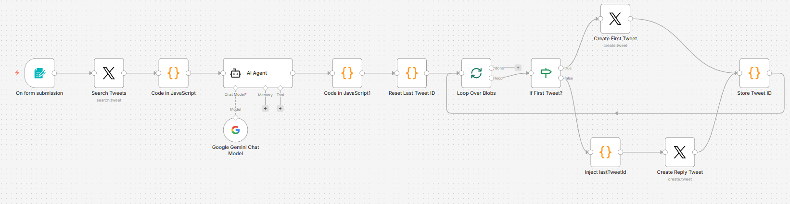
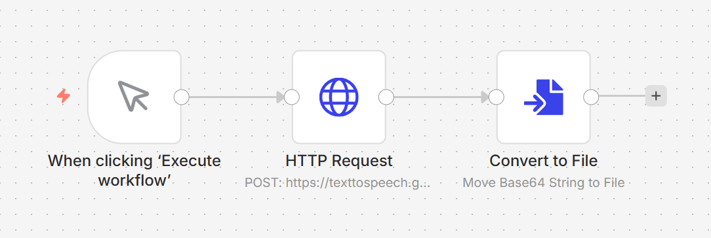
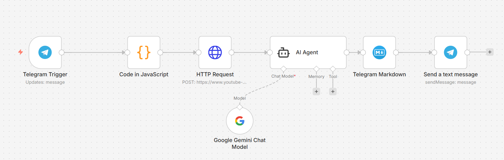
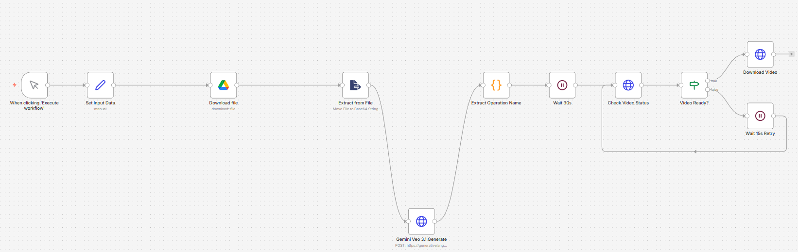

# n8n-flows
Repository that will consist of n8n flows for modern tasks and usecases

---

<video src="https://github.com/user-attachments/assets/ccd7343b-5634-443f-b1c9-7aabc403aef3" controls="controls" muted autoplay loop></video>

## Workflows

---
### X Auto Tweeter

**Purpose:** AI-powered automatic tweet generation and publishing — takes any topic, researches trending tweets about it, and posts an insightful, developer-style thread directly to your X (Twitter) account.

**Trigger:** n8n Web Form (manual on-demand)

**Flow:**
1. **On Form Submission** *(Form Trigger)* — Presents a web form titled *"X Topic To Post About"* with a single input: `What's the Topic?`. Submitting the form kicks off the workflow.
2. **Search Tweets** *(X / Twitter node)* — Searches X for the top 10 recent tweets matching the submitted topic, using your connected X OAuth2 account.
3. **Code in JavaScript** *(Code node)* — Cleans the fetched tweets by stripping retweet prefixes (`RT @user:`), then bundles all tweet texts and count into a single payload for the AI agent.
4. **AI Agent** *(LangChain Agent node)* — Powered by **Google Gemini**, this agent acts as a sharp, opinionated tech blogger. It takes the aggregated tweets and writes **one punchy, insight-driven X post** with:
   - A strong technical hook or hot take as the lead
   - 2–3 concrete bullet points (what it does, why it matters, how to use it)
   - Developer-friendly language and tone (direct, nerdy, authentic)
   - Up to 10 relevant viral hashtags
   - Target length: ~600 characters
5. **Code in JavaScript1** *(Code node — Tweet Splitter)* — Splits the AI-generated post into tweet-sized blobs (default: 270 characters each). If multiple blobs are needed, auto-appends thread numbering like `(1/3)`, `(2/3)` etc.
6. **Reset Last Tweet ID** *(Code node)* — Clears any cached tweet ID from previous runs to ensure clean thread chaining.
7. **Loop Over Blobs** *(Split In Batches node)* — Iterates through each tweet blob one at a time.
8. **If First Tweet?** *(If node)* — Checks if the current blob is the first tweet (`blobIndex === 1`).
   - **True → Create First Tweet** — Posts the first blob as a standalone tweet.
   - **False → Inject lastTweetId → Create Reply Tweet** — Injects the stored tweet ID and posts subsequent blobs as threaded replies to the previous tweet.
9. **Store Tweet ID** *(Code node)* — Saves the ID of the just-posted tweet into workflow static data so the next blob can reply to it, forming the thread chain.

**Capabilities:**
- 🔍 Researches real-time X trends for any topic before writing
- 🤖 AI writes with authentic developer/indie-hacker voice (not corporate fluff)
- 🧵 Automatically handles long posts as properly chained Twitter threads
- 🏷️ Adds viral hashtags to boost reach
- ♻️ Stateful thread chaining — each reply correctly references the previous tweet
- 🚀 On-demand via a simple web form — no coding needed to trigger

**Requirements:**
- X (Twitter) OAuth2 API credentials connected in n8n (node: `X account`)
- Google Gemini (PaLM) API credentials connected in n8n (node: `Google Gemini(PaLM) Api account`)

**Setup Guide:**
1. Import `X-Auto-Tweeter-1.json` into your n8n instance via *Workflows → Import from file*.
2. Connect your **X OAuth2** credentials:
   - Go to the `Search Tweets`, `Create First Tweet`, and `Create Reply Tweet` nodes.
   - Select or create an X OAuth2 credential with read/write permissions.
3. Connect your **Google Gemini API** credentials:
   - Go to the `Google Gemini Chat Model` node.
   - Add your Google PaLM/Gemini API key.
4. Activate the workflow.
5. Open the form URL (visible in the `On form submission` node under *Test URL* or *Production URL*).
6. Enter any topic (e.g., `Claude Code`, `RAG pipelines`, `LangGraph`) and submit.
7. The workflow will search X, generate the post, and publish it (or thread) automatically.

**Customisation Tips:**
- **Change tweet chunk size:** In `Code in JavaScript1`, adjust `maxCharsPerBlob` (default: `270`) to a value up to `280`.
- **Change the AI persona/tone:** Edit the prompt in the `AI Agent` node to match your personal style.
- **Swap the LLM:** Replace the `Google Gemini Chat Model` sub-node with any other LangChain-compatible model (OpenAI, Claude, Mistral, etc.).
- **Disable thread numbering:** Set `addNumbering` to `false` in `Code in JavaScript1` if you prefer clean posts without `(1/2)` suffixes.

---
### Text To Speech (Google)

**Purpose:** Converts any text string into a high-quality MP3 audio file using the **Google Cloud Text-to-Speech API** (WaveNet voices), outputting a downloadable binary audio file directly from n8n.

**Trigger:** Manual — click *"Execute workflow"* in n8n

**Flow:**
1. **When clicking 'Execute Workflow'** *(Manual Trigger)* — Starts the workflow on demand from the n8n editor.
2. **HTTP Request** *(POST to Google TTS API)* — Sends a JSON payload to `https://texttospeech.googleapis.com/v1/text:synthesize` with:
   - `input.text` — The text to be converted to speech
   - `voice.languageCode` — `en-US` (American English)
   - `voice.name` — `en-US-Wavenet-D` (a high-quality WaveNet male voice)
   - `audioConfig.audioEncoding` — `MP3`
   - Authenticated via **Google OAuth2**
3. **Convert to File** *(Convert to File node)* — Reads the `audioContent` field (base64-encoded audio) from the API response and converts it into a binary MP3 file ready for download or downstream use.

**Capabilities:**
- 🎙️ Converts any text to natural-sounding speech using Google WaveNet voices
- 🎵 Outputs a ready-to-use MP3 binary file within the n8n workflow
- 🌍 Supports all Google TTS languages and voice profiles (easily configurable)
- ⚡ Lightweight 3-node pipeline — simple, fast, and extensible
- 🔗 Output can be chained to further nodes (e.g., save to Google Drive, send via email/Telegram, etc.)

**Requirements:**
- Google OAuth2 credentials connected in n8n (node: `Google account`) with **Cloud Text-to-Speech API** enabled in Google Cloud Console

**Setup Guide:**
1. Import `TextToSpeech-Google.json` into your n8n instance via *Workflows → Import from file*.
2. Connect your **Google OAuth2** credentials:
   - Go to the `HTTP Request` node and select or create a `Google OAuth2` credential.
   - Ensure the **Cloud Text-to-Speech API** is enabled in your [Google Cloud Console](https://console.cloud.google.com/apis/library/texttospeech.googleapis.com).
3. Edit the text input:
   - In the `HTTP Request` node, update the `jsonBody` field — change the `"text"` value under `"input"` to your desired text.
4. Click **Execute workflow** to run.
5. The output binary MP3 file will be available in the `Convert to File` node's output.

**Customisation Tips:**
- **Change the voice:** Update `voice.name` in the JSON body to any supported WaveNet or Neural2 voice (see [Google TTS voice list](https://cloud.google.com/text-to-speech/docs/voices)).
- **Change the language:** Update `voice.languageCode` (e.g., `en-GB`, `hi-IN`, `fr-FR`) along with a matching voice name.
- **Change output format:** Swap `audioEncoding` to `OGG_OPUS` or `LINEAR16` (WAV) if needed.
- **Dynamic text input:** Replace the hardcoded text with an n8n expression like `{{ $json.text }}` to feed text from a previous node (e.g., a form, webhook, or AI agent output).
- **Save the audio:** Chain a **Google Drive**, **S3**, or **Write Binary File** node after `Convert to File` to persist the MP3.

---
### TranscribeYT Reliable

**Purpose:** Automatically transcribes YouTube videos and generates AI-powered summaries delivered via Telegram with video title, key highlights, prerequisites, and main takeaways.

**Trigger:** Telegram message containing a YouTube video link

**Flow:**
1. **Telegram Trigger** *(Telegram Trigger node)* — Listens for incoming Telegram messages containing YouTube URLs.
2. **Extract YT ID** *(Code node)* — Uses regex pattern to extract the exact 11-character YouTube video ID from various URL formats (`youtube.com`, `youtu.be`, `youtube shorts`, etc.).
3. **Fetch Transcript** *(HTTP Request node)* — Sends the extracted video ID to `youtube-transcript.io/api/transcripts` API endpoint with Basic Authentication to retrieve the full video transcript.
4. **AI Agent** *(LangChain Agent node)* — Powered by **Google Gemini**, this agent analyzes the complete transcript and structures it into:
   - **Main Topic** — The video's subject in 5-7 words
   - **Summary** — A 2-3 sentence overview
   - **Key Highlights** — 4-6 actionable bullet points
   - **Prerequisites** — Technical requirements or "beginner-friendly" if none
   - **The Big Takeaway** — A single impactful concluding sentence
5. **Structured Output Parser** *(Output Parser node)* — Validates and formats the AI output against a strict JSON schema ensuring consistent structure.
6. **Format Telegram HTML** *(Code node)* — Converts the structured JSON into beautifully formatted HTML with emojis, proper escaping, and readability for Telegram (escapes HTML special characters to prevent crashes).
7. **Send to Telegram** *(Telegram node)* — Sends the formatted HTML message back to the original chat with `parse_mode: HTML` for rich text formatting.

**Capabilities:**
- 📹 Extracts transcripts from any YouTube video URL format (standard links, youtu.be, shorts)
- 🤖 AI-powered intelligent summarization with structured, actionable insights
- 📱 Seamless Telegram integration — works directly in chat, no switching apps
- 🎯 Highlights key points with prerequisites and takeaways for quick learning
- 🎨 Beautiful HTML-formatted responses with emojis for visual appeal
- ⚡ Fast turnaround — transcript fetch and AI processing in seconds
- 🔗 Easily extensible — can be modified to output to other channels (email, Slack, etc.)

**Requirements:**
- Telegram bot token connected in n8n (node: `Telegram account`)
- youtube-transcript.io API access (Basic Auth credentials as shown in workflow)
- Google Gemini API credentials connected in n8n (node: `Google Gemini` API account)

**Setup Guide:**
1. Import `TranscribeYouTube.json` into your n8n instance via *Workflows → Import from file*.
2. Connect your **Telegram bot** credentials:
   - Go to the `Telegram Trigger` and `Send to Telegram` nodes.
   - Select or create a Telegram bot credential with your bot token.
3. Add **youtube-transcript.io credentials:**
   - Go to the `Fetch Transcript` HTTP Request node.
   - Update the `Authorization` header with your youtube-transcript.io API key (Basic Auth format: `Basic <your-api-key>`).
4. Connect your **Google Gemini API** credentials:
   - Go to the `Google Gemini` node (under `AI Agent`).
   - Add your Google Gemini API key.
5. Activate the workflow.
6. Send any YouTube link to your Telegram bot (e.g., `Check this: https://www.youtube.com/watch?v=xyz123abc456`).
7. The workflow will fetch, transcribe, summarize, and send the formatted response automatically.

**Customisation Tips:**
- **Change AI focus:** Edit the AI Agent's prompt to request different aspects (e.g., focus on code examples, industry impact, or technical depth).
- **Filter by video length:** Add a validation check after `Fetch Transcript` to skip videos over a certain duration if needed.
- **Change output language:** Update the AI Agent prompt to request summaries in any language (e.g., Spanish, French, Hindi).
- **Add more structured fields:** Expand the JSON schema in `Structured Output Parser` to include additional fields like "Difficulty Level", "Audience", "Related Topics", etc.
- **Route to other channels:** Replace the final `Send to Telegram` node with email, Slack, or Discord to deliver summaries elsewhere.
- **Batch processing:** Modify the `Telegram Trigger` to collect multiple YouTube links and process them in bulk before sending a consolidated summary.

---
### TextToSpeech-Video-Generation (Experimental)

**Purpose:** Generates AI-powered video content from text input by combining Google Cloud Text-to-Speech (natural audio synthesis) with Google Veo 3.1 video generation, producing a realistic podcast-style video of a host speaking naturally.

**Trigger:** Manual — click *"Execute workflow"* in n8n

**Flow:**
1. **Manual Trigger** *(Manual Trigger node)* — Starts the workflow on-demand from the n8n editor.
2. **Set Input Data** *(Set node)* — Configures the input parameters:
   - `inputText` — The text script the podcast host will "speak"
   - `geminiApiKey` — Your Google Gemini API key for authentication
3. **Google TTS** *(HTTP Request node)* — Sends the input text to `texttospeech.googleapis.com/v1/text:synthesize` to generate natural-sounding audio using Google's Neural2-D voice (en-US).
4. **Convert to File** *(Convert to File node)* — Converts the base64-encoded audio response into a binary MP3 file (`speech.mp3`).
5. **Google Drive Download** *(Google Drive node)* — Downloads a pre-uploaded podcast frame/avatar image from Google Drive (file ID: `1OA9uKfM9W1Rc69yAZyIO4h9qHojTNHpB`) as a PNG image that will serve as the podcast host's visual.
6. **Gemini Upload** *(Code node)* — Uploads the downloaded PNG image to Google's Generative AI platform using a resumable upload session:
   - Initiates the upload with the `X-Goog-Upload-Protocol: resumable` header
   - Confirms upload completion and retrieves the file URI for use in the video generation API
7. **Gemini Veo Generate** *(HTTP Request node)* — Calls `generativelanguage.googleapis.com/v1beta/models/veo-3.1-generate-001:predictLongRunning` to generate a video:
   - Input: The uploaded podcast frame (image) + prompt (`"A podcast host talking naturally. Professional studio."`)
   - Generates a long-running async operation that produces a video of the host "speaking" the audio
8. **Wait 30 seconds** *(Wait node)* — Pauses execution for 30 seconds to allow the Veo model time to process and generate the video.
9. **Status Check** *(HTTP Request node)* — Polls the Veo operation's status endpoint to check if video generation is complete (`done: true`).
10. **Ready If** *(If node)* — Conditional check that verifies the video generation is finished (`$json.done === true`).

**Capabilities:**
- 🎬 Generates realistic AI-produced video content from plain text
- 🎙️ Natural speech synthesis via Google Neural2 voices (professional quality)
- 🖼️ Combines custom avatar/image with generated video for podcast-like presentation
- ⚙️ Long-running async operation handling with polling for reliable completion detection
- 🔐 Secure resumable file upload protocol for large media assets
- 🎨 Fully customizable input text and podcast frame image
- 📱 Outputs a complete video file ready for social media, YouTube, or streaming platforms

**Requirements:**
- Google OAuth2 credentials connected in n8n (node: `Google account`) with:
  - **Cloud Text-to-Speech API** enabled
  - **Google Drive API** enabled (to download the podcast frame image)
  - **Generative AI API** enabled
- Google Gemini API key (with access to Veo 3.1 model)
- A pre-uploaded podcast/avatar frame image stored in Google Drive (update the `fileId` in the `Google Drive Download` node)

**Setup Guide:**
1. Import `Text2VideoExp.json` into your n8n instance via *Workflows → Import from file*.
2. Connect your **Google OAuth2** credentials:
   - Go to the `Google Drive Download` node.
   - Select or create a `Google OAuth2` credential with **Cloud Text-to-Speech**, **Google Drive**, and **Generative AI API** permissions.
3. Prepare your **podcast frame image:**
   - Upload a professional podcast host image/avatar to your Google Drive.
   - Copy the file ID from the shareable link and update the `fileId` value in the `Google Drive Download` node.
4. Configure your **Gemini API key:**
   - In the `Set Input Data` node, replace `YOUR_GEMINI_API_KEY` with your actual Google Gemini API key.
5. Customize the input text:
   - In the `Set Input Data` node, update the `inputText` value to any script you want the podcast host to deliver.
6. Click **Execute workflow** to start.
7. Monitor the execution — the workflow will generate audio, upload the image, initiate video generation, wait, poll for completion, and output status.

**Customisation Tips:**
- **Change the voice:** In the `Google TTS` node, modify `voice.name` to any supported Google TTS voice (e.g., `en-US-Neural2-A`, `en-GB-Neural2-B`).
- **Adjust processing time:** In the `Wait` node, change the wait duration (default: 30 seconds) based on video length and API performance — may need 60+ seconds for longer videos.
- **Custom video prompt:** In the `Veo Generate` node, update the prompt from `"A podcast host talking naturally. Professional studio."` to describe the desired video style (e.g., `"A confident tech expert in a modern studio, gesturing while speaking"`).
- **Different podcast frames:** Upload multiple images to Google Drive and randomly select one in a code node before downloading to add variety.
- **Add output routing:** Chain the workflow output to save the video to Google Drive, email it, or upload to YouTube/social media platforms.
- **Error handling:** Add a retry loop after the `Status Check` node in case the video isn't ready after the first poll — extend wait time and re-poll if `done !== true`.
- **Combine with video editing:** Chain the generated video output to an FFmpeg or video editing node to add overlays, captions, or background music before final delivery.
